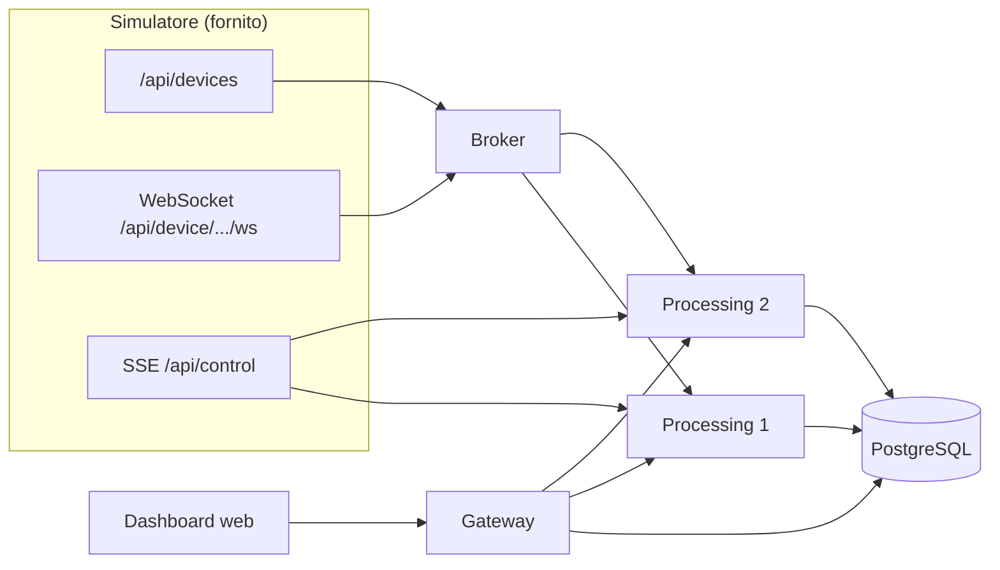

# Diagramma architettura (Project-42)

## Vista logica

### Flussi

1. **Ingestione**: broker apre N WebSocket verso il simulatore e fa **fan-out** HTTP `POST /internal/ingest` verso ogni replica.
2. **Elaborazione**: ogni replica mantiene finestra per sensore, FFT, classificazione; scrive su DB con `ON CONFLICT DO NOTHING`.
3. **Fault injection**: SSE `SHUTDOWN` chiude **una** replica alla volta.
4. **Presentazione**: il browser parla solo con **gateway** (REST + SSE); il gateway interroga DB e, con failover, le repliche per dati in RAM.

*(Esportare in PNG da GitHub / Mermaid Live Editor per le slide.)*
