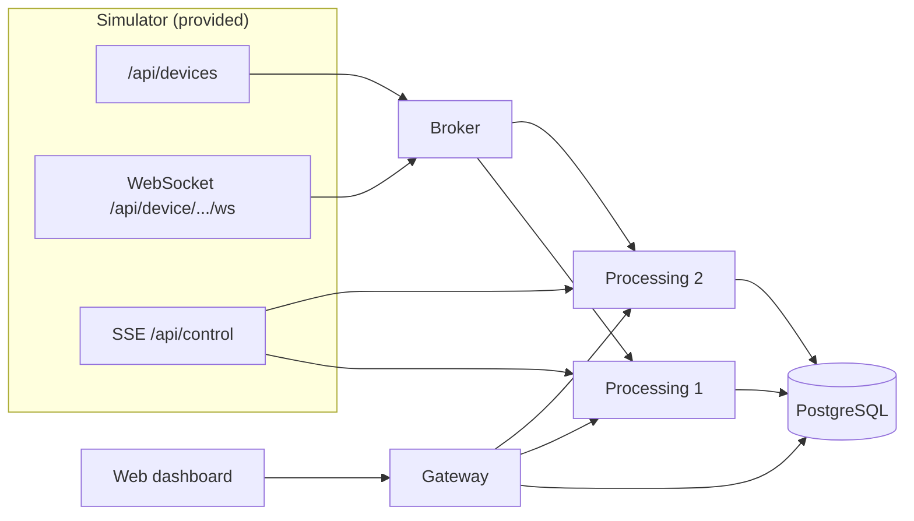

# Architecture diagram (Project-42)

## Logical view

### Flows

1. **Ingestion**: the broker opens N WebSockets to the simulator and **fan-out** HTTP `POST /internal/ingest` to every replica.
2. **Processing**: each replica keeps a per-sensor window, FFT, classification; writes to the DB with `ON CONFLICT DO NOTHING`.
3. **Fault injection**: SSE `SHUTDOWN` stops **one** replica at a time.
4. **Presentation**: the browser talks only to the **gateway** (REST + SSE); the gateway queries the DB and, with failover, replicas for in-RAM data.

*(Export to PNG from GitHub / Mermaid Live Editor for slides.)*
